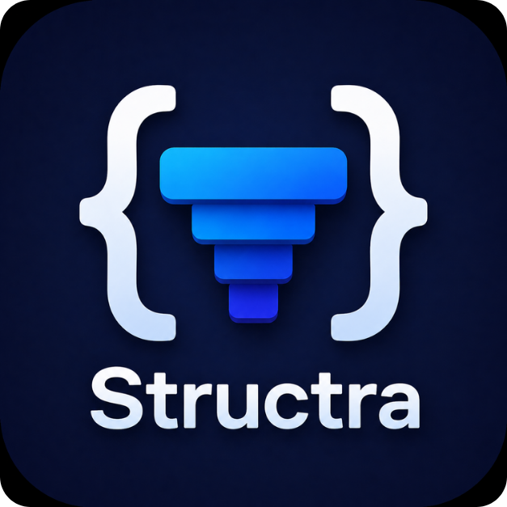

<p align="center">
  
</p>

# Structra

Structra is a desktop workbench for building structured data visually and exporting it as real, usable artifacts. It starts with a visual form/schema builder, shows the structure behind the UI, generates JSON/YAML/TOML/XML/JSON Schema, and includes a YAML workflow builder for turning those structures into portable automation pipelines.

Built with Tauri 2, React, Vite, Tailwind CSS, Zustand, Rust, and React Flow.

## Why Structra Exists

Most structured-data tools start from text and ask users to mentally reconstruct the shape. Structra works in the other direction:

```text
Visual model -> Structure -> Schema -> Workflow
```

The goal is to make payloads, config files, API contracts, validation schemas, and workflow definitions easier to design, inspect, and share.

## What You Can Do in v1.0.0

- Build nested structured data visually with text, number, checkbox, select, section, and grid/container nodes.
- Use explicit bindings such as `user.profile.role` to map visual fields into output structure.
- Switch between form-oriented editing and structure-oriented inspection.
- Export live output as JSON, YAML, TOML, XML, or JSON Schema.
- Import JSON values or JSON Schema and rebuild the visual model.
- Save reusable templates for common payloads and configurations.
- Save/load `.sdb.json` project files containing both the data model and workflow model.
- Design YAML workflows with run steps, action references, approval gates, environment variables, and dependencies.
- Edit workflow dependencies visually with a React Flow graph, including add-after controls, node duplicate/delete, edge removal, minimap, and layout reset.
- Export workflows as portable Structra YAML, GitHub Actions YAML, or GitLab CI YAML.

## Screenshots


## Install

For the v1.0.0 Windows release, attach the generated installers to the GitHub release:

- `Structra_1.0.0_x64-setup.exe` - NSIS installer
- `Structra_1.0.0_x64_en-US.msi` - MSI installer

Current local build outputs are created under:

```text
src-tauri/target/release/bundle/nsis/
src-tauri/target/release/bundle/msi/
```

## Development

### Prerequisites

- Node.js LTS
- pnpm
- Rust stable
- Tauri system prerequisites for your OS

### Install Dependencies

```bash
pnpm install
```

### Run the Web UI

```bash
pnpm dev
```

### Run the Tauri App in Development

```bash
pnpm tauri dev
```

### Build the Frontend

```bash
pnpm build
```

### Run Workflow Smoke Tests

```bash
pnpm test:workflow
```

### Build Desktop Installers

```bash
pnpm tauri build
```

## Verification Used for v1.0.0

The v1 release candidate was verified with:

```bash
pnpm build
pnpm test:workflow
cargo fmt --check
cargo test
cargo check
pnpm tauri build
```

Additional in-app browser smoke checks covered:

- Branded page title and app shell.
- Workflow graph rendering.
- Add-after graph controls.
- Dependency edge rendering.
- Empty workflow state.
- No browser console errors during the graph smoke flow.

## Project Structure

```text
.
|-- docs/                # Logo, release notes, reference material
|-- public/              # Browser-facing static assets
|-- scripts/             # Lightweight project smoke checks
|-- src/                 # React/TypeScript frontend
|-- src-tauri/           # Tauri/Rust desktop shell and transform commands
|-- package.json         # Frontend scripts and dependencies
`-- vite.config.ts       # Vite/Tauri development configuration
```

## Architecture Notes

- The frontend owns the interactive builder state, canvas editing, templates, and workflow graph.
- Rust/Tauri commands handle structured output generation and validation.
- Project files preserve the user-facing document model plus the formal internal representation and workflow state.
- Workflow import/export intentionally supports a practical subset of portable YAML, GitHub Actions, and GitLab CI for v1.

## v1 Scope

Structra v1.0.0 is focused on dependable visual modeling, schema/data export, JSON/Schema import, and YAML workflow authoring. Future milestones can expand toward richer graph relationships, deeper CI/CD import coverage, workflow execution, and schema-driven form generation.

## Maintainer

Maintained by Herb.

## License

MIT. See [LICENSE](LICENSE).
